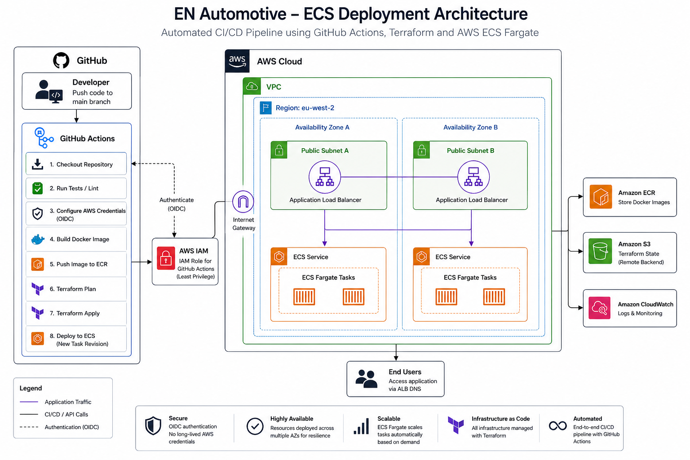
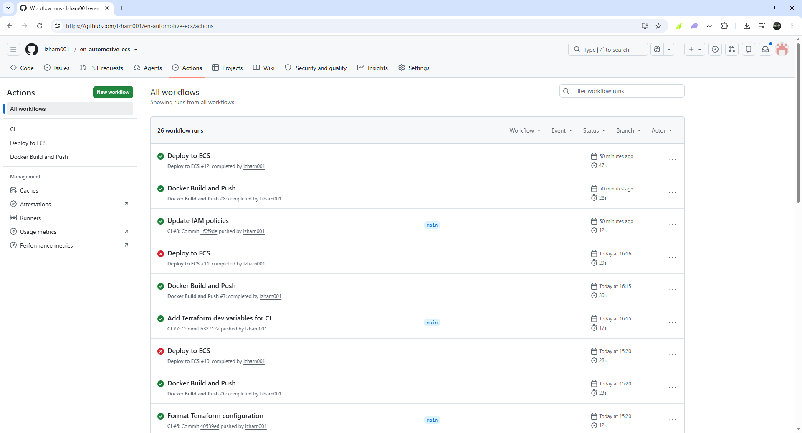
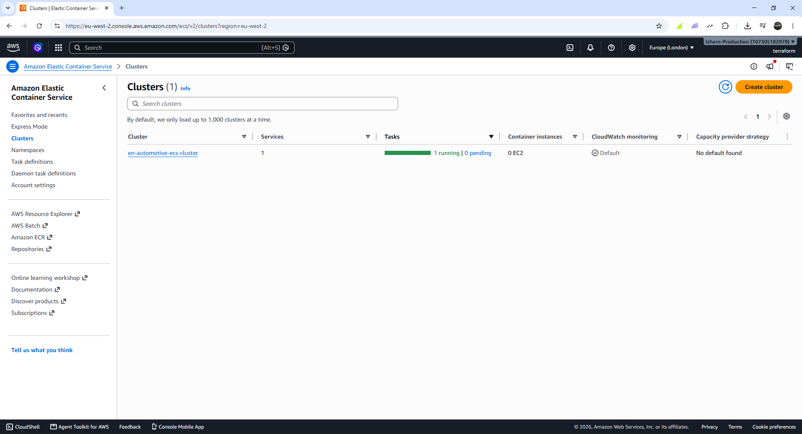
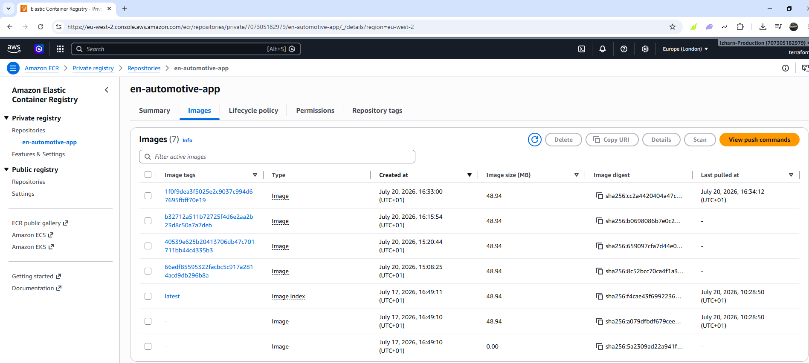
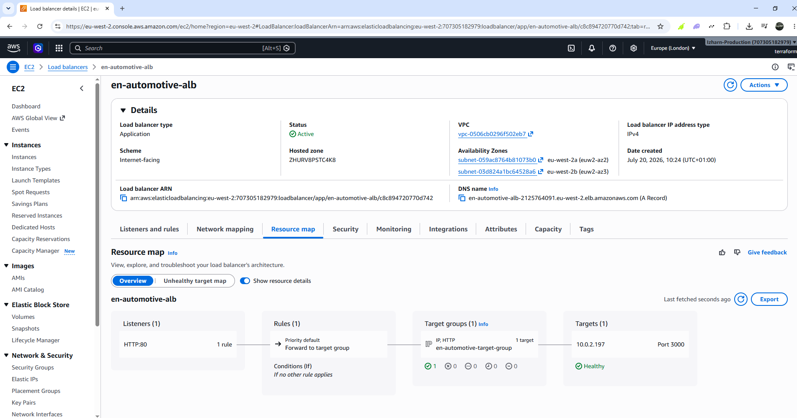
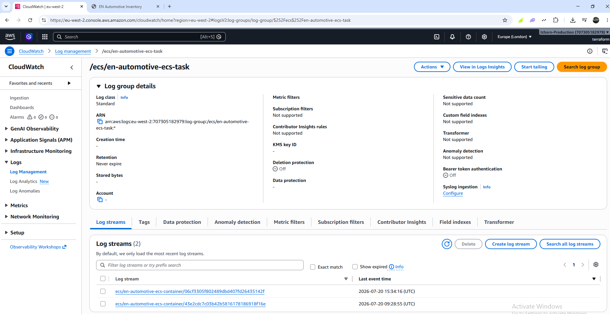
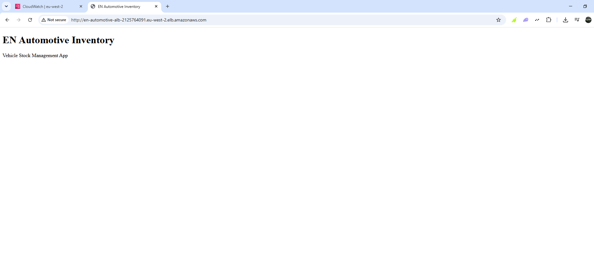

<h1 align="center">
EN Automotive - Vehicle Stock Management Platform
</h1>

<p align="center">
AWS • Terraform • Docker • ECS Fargate • GitHub Actions • CI/CD
</p>

<p align="center">

</p>

A production-style DevOps project demonstrating how to deploy a containerised Node.js application to AWS using Infrastructure as Code and a fully automated CI/CD pipeline.

The project provisions AWS infrastructure with Terraform, stores Docker images in Amazon ECR, deploys containers to Amazon ECS Fargate behind an Application Load Balancer, and automatically deploys new application versions using GitHub Actions and GitHub OpenID Connect (OIDC).

The aim of this project was to gain hands-on experience building a cloud-native deployment pipeline using modern DevOps practices and AWS services.

---

# Architecture


The application is deployed using the following workflow:

```text
Developer
    │
    ▼
GitHub Repository
    │
    ▼
GitHub Actions
    │
    ├── Build Docker Image
    ├── Authenticate to AWS (OIDC)
    ├── Push Image to Amazon ECR
    ├── Terraform Plan
    └── Terraform Apply
             │
             ▼
        Amazon ECS Fargate
             │
             ▼
 Application Load Balancer
             │
             ▼
          End Users
```

---

# Project Goals

This project was built to demonstrate practical experience with:

* Infrastructure as Code using Terraform
* Docker containerisation
* Amazon ECS Fargate
* GitHub Actions CI/CD
* GitHub OpenID Connect (OIDC)
* Amazon Elastic Container Registry (ECR)
* Application Load Balancers
* AWS networking
* IAM roles and policies
* Cloud-native deployments

Rather than manually creating AWS resources, the entire infrastructure is defined and managed through Terraform.

---

# Technology Stack

| Technology                | Purpose                   |
| ------------------------- | ------------------------- |
| Node.js                   | Sample web application    |
| Express.js                | Web framework             |
| Docker                    | Containerisation          |
| Terraform                 | Infrastructure as Code    |
| GitHub Actions            | CI/CD                     |
| Amazon ECS Fargate        | Container orchestration   |
| Amazon ECR                | Docker image repository   |
| Application Load Balancer | Traffic routing           |
| Amazon VPC                | Networking                |
| IAM                       | Permissions and security  |
| GitHub OIDC               | Secure AWS authentication |
| Amazon S3                 | Terraform remote state    |
| CloudWatch                | Container logging         |

---

# Features

* Infrastructure fully managed using Terraform
* Modular Terraform codebase
* Remote Terraform state stored in Amazon S3
* Secure GitHub OIDC authentication
* Fully automated GitHub Actions deployment pipeline
* Docker image build and push to Amazon ECR
* Amazon ECS Fargate deployment
* Application Load Balancer
* Rolling deployments
* CloudWatch logging

---

# Repository Structure

```text
.
├── app/
│   ├── public/
│   ├── server.js
│   ├── package.json
│   └── Dockerfile
│
├── infra/
│   ├── backend.tf
│   ├── provider.tf
│   ├── variables.tf
│   ├── outputs.tf
│   ├── main.tf
│   │
│   └── modules/
│       ├── alb/
│       ├── ecs/
│       ├── ecr/
│       ├── iam/
│       └── network/
│
└── .github/
    └── workflows/
```

---

# Infrastructure

Terraform provisions the following AWS resources:

## Networking

* Virtual Private Cloud (VPC)
* Public subnets
* Internet Gateway
* Route Tables
* Security Groups

## Compute

* Amazon ECS Cluster
* ECS Task Definition
* ECS Service

## Container Registry

* Amazon Elastic Container Registry (ECR)

## Load Balancing

* Application Load Balancer
* Target Group
* Listener

## Identity & Access

* IAM Roles
* IAM Policies
* GitHub OpenID Connect Provider
* GitHub Actions Deployment Role

---

# CI/CD Pipeline

Every push to the `main` branch automatically triggers the deployment workflow.

The pipeline performs the following steps:

1. Checkout the repository
2. Install dependencies
3. Run application checks
4. Authenticate to AWS using GitHub OIDC
5. Build the Docker image
6. Push the image to Amazon ECR
7. Run Terraform Plan
8. Apply infrastructure changes
9. Register a new ECS task definition revision
10. Deploy the updated application to ECS

No AWS access keys are stored in GitHub.

---

# Security

Instead of using long-lived IAM user credentials, the deployment pipeline authenticates using GitHub OpenID Connect.

This provides several benefits:

* Temporary AWS credentials
* No stored AWS secrets
* Least-privilege IAM permissions
* More secure deployment pipeline

---

# Terraform Remote State

Terraform state is stored remotely in Amazon S3.

Using remote state ensures both local development and GitHub Actions work from the same infrastructure state, preventing configuration drift between environments.

---

# Application

The sample application is a simple Vehicle Stock Management application built with Node.js and Express.

Current functionality includes:

* Homepage
* Vehicle API endpoint
* Dockerised deployment
* Container health checks
* Automated deployments

The application provides a foundation that can easily be expanded with:

* Database integration
* Authentication
* Vehicle CRUD operations
* Image uploads
* Search and filtering

---

# Screenshots


* GitHub Actions



* Amazon ECS Cluster



* Amazon ECR Repository



* Application Load Balancer



* CloudWatch Logs



* Running application



---

# Challenges

Some of the challenges encountered during the project included:

* Configuring GitHub OIDC authentication
* Managing IAM permissions for automated deployments
* Debugging Terraform and AWS permission issues

Working through these problems provided valuable hands-on experience with real-world cloud infrastructure and deployment workflows.

---

# Future Improvements

Planned enhancements include:

* HTTPS with AWS Certificate Manager (ACM)
* Route 53 custom domain
* ECS Service Auto Scaling
* Blue/Green deployments
* CloudWatch dashboards and alarms
* Multi-environment deployments (development, staging and production)
* Automated testing within the CI pipeline
* Kubernetes deployment for comparison with Amazon ECS

---

# Author

**Izharn Mohammed**

AWS Certified Solutions Architect – Associate

HashiCorp Certified: Terraform Associate

This project forms part of my Cloud & DevOps portfolio as I continue building practical experience with AWS, Terraform, Docker, Kubernetes and CI/CD automation.
