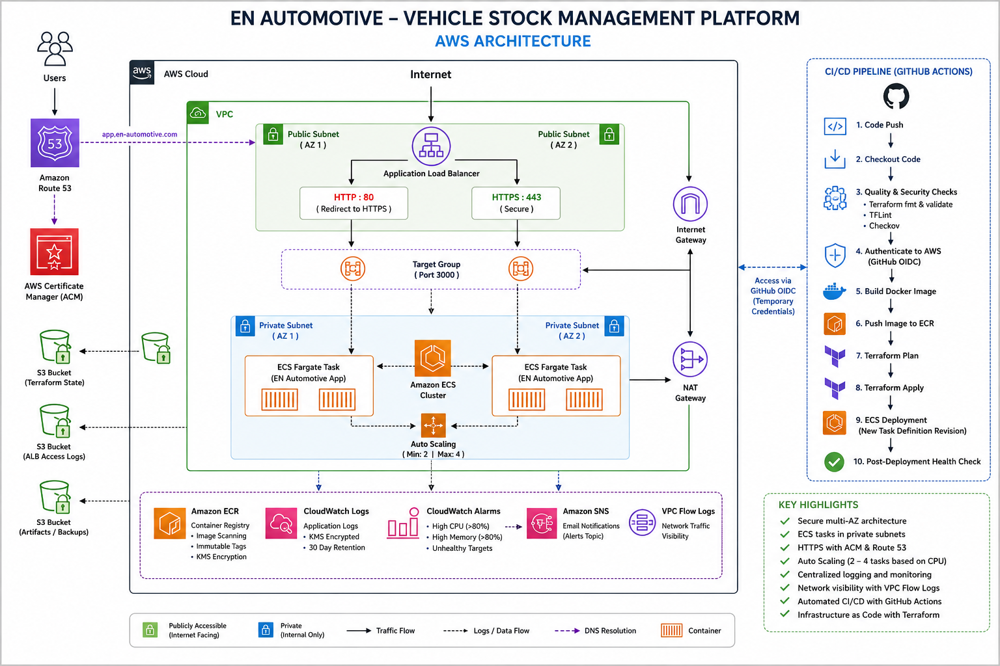
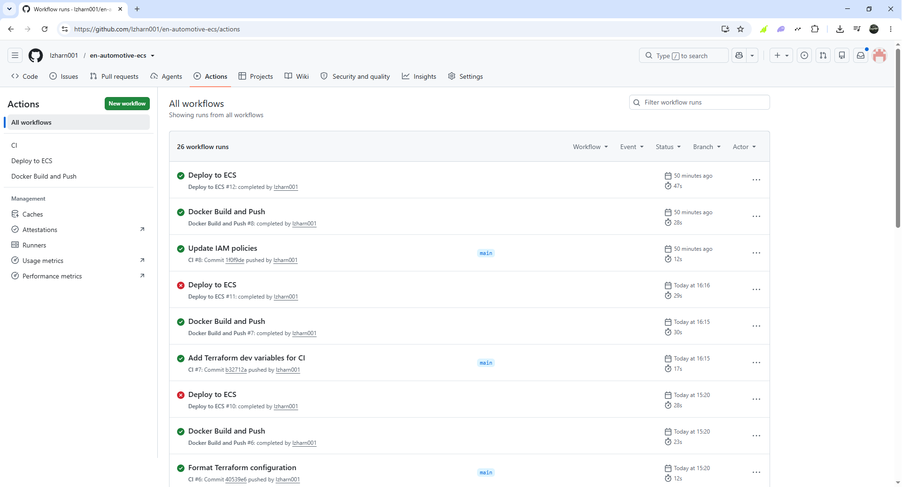
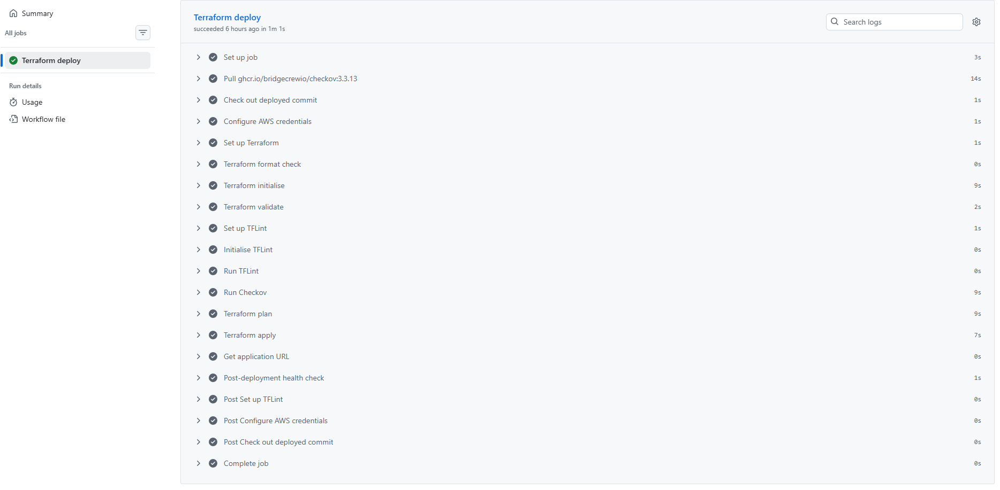
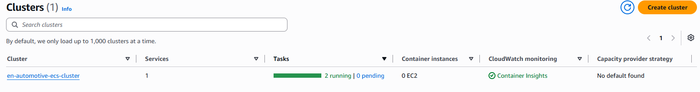
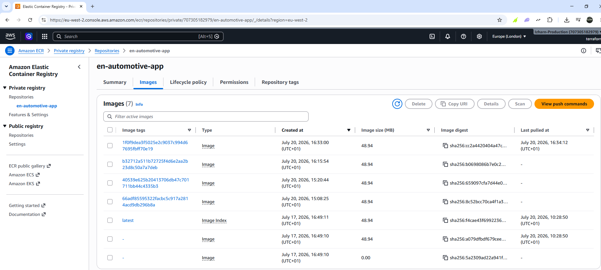
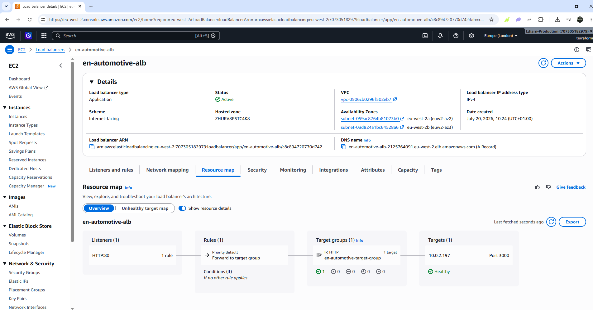
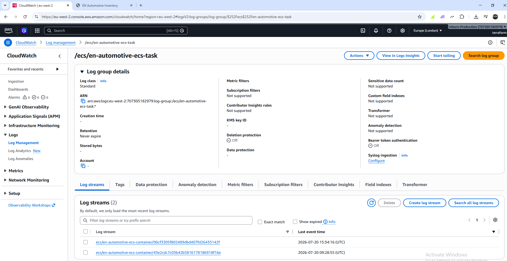
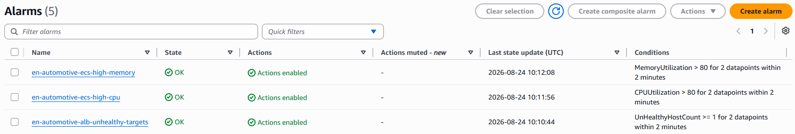
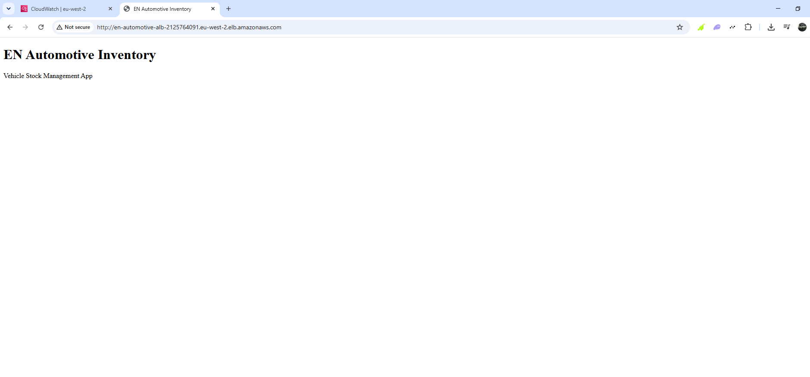

<h1 align="center">
EN Automotive - Vehicle Stock Management Platform
</h1>

<p align="center">
  <strong>AWS • Terraform • Docker • ECS Fargate • GitHub Actions • CI/CD • Security • Observability</strong>
</p>

<p align="center">
  
</p>

## Overview

EN Automotive is a production-style Cloud and DevOps project demonstrating the deployment of a containerised Node.js application to AWS using Infrastructure as Code, automated CI/CD, secure cloud networking, monitoring and security controls.

The application runs on **Amazon ECS Fargate** behind an **Application Load Balancer**, with ECS tasks isolated inside private subnets across multiple Availability Zones.

The entire AWS environment is provisioned using **Terraform**, while **GitHub Actions** automates infrastructure validation, security scanning, Docker image builds and application deployments.

GitHub Actions authenticates to AWS using **OpenID Connect (OIDC)** and temporary AWS credentials, removing the need to store long-lived AWS access keys in GitHub.

This project was built to develop practical experience designing, deploying, securing and operating a cloud-native workload using technologies and practices commonly used in Cloud and DevOps engineering.

---

## Architecture

The platform uses a multi-AZ AWS architecture with a clear separation between internet-facing and private application resources.

### Request Flow

```text
Users
  │
  ▼
Route 53
  │
  ▼
Application Load Balancer
HTTP :80 → HTTPS :443
  │
  ▼
Target Group
  │
  ├─────────────────────┐
  ▼                     ▼
ECS Fargate         ECS Fargate
Private Subnet      Private Subnet
AZ 1                AZ 2
  │                     │
  └──────────┬──────────┘
             │
      ECS Auto Scaling
        Min 2 / Max 4
```

The Application Load Balancer is deployed across public subnets while the ECS Fargate tasks run in private subnets.

The ECS security group only accepts application traffic from the ALB security group, preventing direct internet access to the containers.

---

## Technology Stack

| Technology | Purpose |
| --- | --- |
| Node.js | Application runtime |
| Express.js | Web application framework |
| Docker | Application containerisation |
| Terraform | Infrastructure as Code |
| GitHub Actions | CI/CD automation |
| GitHub OIDC | Secure AWS authentication |
| Amazon ECS Fargate | Container orchestration |
| Amazon ECR | Container image registry |
| Application Load Balancer | Traffic distribution |
| Amazon VPC | Network isolation |
| NAT Gateway | Outbound access for private workloads |
| Route 53 | DNS management |
| AWS Certificate Manager | TLS certificate management |
| IAM | AWS permissions and access control |
| Amazon S3 | Terraform state and ALB logs |
| AWS KMS | Encryption at rest |
| CloudWatch Logs | Application logging |
| CloudWatch Alarms | Infrastructure monitoring |
| VPC Flow Logs | Network traffic visibility |
| Amazon SNS | Infrastructure alert notifications |
| TFLint | Terraform static analysis |
| Checkov | Infrastructure security scanning |

---

## Key Features

### Infrastructure as Code

- AWS infrastructure managed entirely through Terraform
- Modular Terraform architecture
- Remote Terraform state stored in Amazon S3
- Consistent resource tagging
- Infrastructure changes deployed through CI/CD

### Container Platform

- Dockerised Node.js application
- Amazon ECR container registry
- Amazon ECS Fargate
- ECS tasks distributed across multiple Availability Zones
- Rolling application deployments
- Container and ALB health checks

### Networking

- Custom Amazon VPC
- Public and private subnets
- Multi-AZ architecture
- Internet Gateway
- NAT Gateway
- Public and private route tables
- Security group isolation
- ECS tasks inaccessible directly from the internet
- VPC Flow Logs

### HTTPS & DNS

- Route 53 DNS
- AWS Certificate Manager TLS certificate
- HTTPS listener on port 443
- HTTP traffic redirected to HTTPS
- Application Load Balancer

### Auto Scaling

- ECS Service Auto Scaling
- Minimum of 2 running tasks
- Maximum of 4 running tasks
- CPU target tracking
- Automatic scale-in and scale-out

### Observability

- CloudWatch application logs
- KMS-encrypted log storage
- VPC Flow Logs
- ALB access logs
- CPU utilisation alarms
- Memory utilisation alarms
- Unhealthy ALB target alarms
- SNS email notifications

### Security

- GitHub OIDC authentication
- Temporary AWS credentials
- No AWS access keys stored in GitHub
- Least-privilege IAM policies
- Restricted `iam:PassRole`
- ECR image scanning
- Immutable ECR image tags
- KMS encryption
- Terraform security scanning with Checkov
- Terraform linting with TFLint

---

## Repository Structure

```text
.
├── app/
│   ├── public/
│   ├── server.js
│   ├── package.json
│   ├── package-lock.json
│   └── Dockerfile
│
├── infra/
│   ├── backend.tf
│   ├── provider.tf
│   ├── variables.tf
│   ├── outputs.tf
│   ├── main.tf
│   ├── .checkov.yaml
│   │
│   └── modules/
│       ├── acm/
│       ├── alb/
│       ├── ecs/
│       ├── ecr/
│       ├── iam/
│       ├── kms/
│       ├── monitoring/
│       ├── network/
│       ├── route53/
│       └── s3/
│
├── images/
│   └── architecture.png
│
└── .github/
    └── workflows/
```

---

# Infrastructure

## Networking

Terraform provisions the underlying AWS network including:

- Custom VPC
- Public subnets
- Private subnets
- Multiple Availability Zones
- Internet Gateway
- NAT Gateway
- Elastic IP
- Public route tables
- Private route tables
- Application Load Balancer security group
- ECS security group
- VPC Flow Logs

The architecture separates public-facing infrastructure from the application workload.

The **Application Load Balancer** resides in public subnets and accepts internet traffic.

The **ECS Fargate tasks** reside in private subnets and do not receive public IP addresses.

Application traffic follows:

```text
Internet
   │
   ▼
Application Load Balancer
   │
   │ Security Group
   ▼
ECS Fargate Tasks
Private Subnets
```

The ECS security group only permits inbound application traffic originating from the ALB security group.

---

## ECS Fargate

The Node.js application runs as Docker containers on Amazon ECS using the Fargate launch type.

Terraform manages:

- ECS Cluster
- ECS Task Definition
- ECS Service
- Container configuration
- Fargate networking
- ALB integration
- Container logging
- Health checks
- Service Auto Scaling

Fargate removes the requirement to provision and manage EC2 worker instances.

The service maintains at least **two ECS tasks**, helping provide application availability across Availability Zones.

---

## ECS Auto Scaling

AWS Application Auto Scaling automatically adjusts the number of running ECS tasks.

Current configuration:

```text
Minimum capacity:        2 tasks
Maximum capacity:        4 tasks
Target CPU utilisation:  65%
Scale-in cooldown:       60 seconds
Scale-out cooldown:      60 seconds
```

The scaling policy uses:

```text
ECSServiceAverageCPUUtilization
```

as the target tracking metric.

Terraform is configured so that Application Auto Scaling can control the ECS desired count without Terraform continuously attempting to reset dynamically scaled capacity.

---

## Amazon ECR

Docker images are stored in Amazon Elastic Container Registry.

The ECR configuration includes:

- Image scanning on push
- Immutable image tags
- KMS encryption
- Terraform management
- CI/CD integration

Application images are tagged using the **Git commit SHA**.

For example:

```text
en-automotive-app:8078c7f880a4cdf465b60f71a39e772f83046f95
```

This provides traceability between:

```text
Git Commit
    │
    ▼
Docker Image
    │
    ▼
ECS Task Definition
    │
    ▼
Running Deployment
```

Using immutable SHA-based image tags also avoids relying on mutable `latest` tags for production-style deployments.

---

## Application Load Balancer

The Application Load Balancer provides the public entry point into the application.

Terraform manages:

- Application Load Balancer
- ALB security group
- Target group
- Health checks
- HTTP listener
- HTTPS listener
- ALB access logging

HTTP requests on port `80` are redirected to HTTPS:

```text
HTTP :80
   │
   ▼
301 Redirect
   │
   ▼
HTTPS :443
```

HTTPS traffic is then forwarded to the ECS target group.

---

## Route 53 & HTTPS

DNS is managed using Amazon Route 53.

AWS Certificate Manager provides the TLS certificate used by the Application Load Balancer.

The request path is:

```text
Domain
  │
  ▼
Route 53
  │
  ▼
Application Load Balancer
  │
 HTTPS
  │
  ▼
ECS Application
```

This provides encrypted traffic between users and the public application endpoint.

---

# CI/CD Pipeline

GitHub Actions provides the automated deployment pipeline.

A deployment follows the general workflow:

```text
Git Push
   │
   ▼
Checkout Repository
   │
   ▼
Terraform Quality Checks
   │
   ├── terraform fmt
   ├── terraform validate
   ├── TFLint
   └── Checkov
   │
   ▼
Authenticate to AWS
GitHub OIDC
   │
   ▼
Build Docker Image
   │
   ▼
Push Image to ECR
   │
   ▼
Terraform Plan
   │
   ▼
Terraform Apply
   │
   ▼
New ECS Task Definition
   │
   ▼
Rolling ECS Deployment
   │
   ▼
Application Health Check
```

Infrastructure and application changes can therefore be validated and deployed from version-controlled code.

---

## GitHub OIDC Authentication

The CI/CD pipeline does not store permanent AWS IAM user credentials.

Instead, GitHub Actions authenticates to AWS using OpenID Connect.

```text
GitHub Actions
      │
      ▼
GitHub OIDC Token
      │
      ▼
AWS STS
      │
      ▼
AssumeRoleWithWebIdentity
      │
      ▼
Temporary AWS Credentials
```

The AWS IAM trust policy restricts which GitHub repository can assume the deployment role.

This approach removes the need to store:

```text
AWS_ACCESS_KEY_ID
AWS_SECRET_ACCESS_KEY
```

as GitHub repository secrets.

---

# IAM & Least Privilege

IAM was an important part of the project.

Terraform requires permissions both to **modify infrastructure** and to **read existing infrastructure during state refreshes**.

Rather than assigning administrator access to GitHub Actions, the CI deployment permissions were progressively reduced to the actions required by the project.

The GitHub Actions role uses separate policies covering areas such as:

- Core deployment services
- AWS networking
- Security and IAM
- Storage

Where possible, permissions are scoped to project-specific AWS resources.

### Restricted PassRole

`iam:PassRole` is restricted to the ECS task execution role and includes a service condition:

```text
iam:PassedToService = ecs-tasks.amazonaws.com
```

This allows ECS to receive the required task execution role without giving the deployment pipeline unrestricted role-passing permissions.

---

# Infrastructure Security Scanning

Terraform configuration is automatically checked during CI.

The pipeline includes:

```text
terraform fmt
terraform validate
TFLint
Checkov
```

Checkov performs static analysis against AWS and Terraform security policies.

During development, Checkov findings helped identify and remediate issues involving:

- Security group rules
- IAM permissions
- ECR encryption
- ECR image mutability
- CloudWatch encryption
- VPC logging
- Load balancer configuration
- S3 configuration
- Infrastructure logging

Applicable findings were remediated rather than simply disabling security scanning.

Where a security control was not appropriate for the scope of the portfolio environment, the exception is explicitly documented through the Checkov configuration.

This keeps the CI security gate meaningful while recognising the difference between a portfolio workload and a large production enterprise environment.

---

# Encryption

Encryption is used across several components of the platform.

### Amazon ECR

Container images are encrypted at rest using AWS KMS.

### CloudWatch

ECS application logs use KMS encryption.

### Amazon SNS

The infrastructure alert topic is encrypted at rest.

### HTTPS

Traffic entering the application is encrypted using TLS through AWS Certificate Manager and the Application Load Balancer.

---

# Logging & Observability

The project includes multiple layers of observability rather than relying only on application logs.

## CloudWatch Logs

ECS containers send application logs to Amazon CloudWatch.

The log group uses:

- KMS encryption
- 30-day retention
- Centralised application logging

---

## VPC Flow Logs

VPC Flow Logs provide visibility into network traffic.

Flow logs capture network metadata for traffic traversing the VPC and can assist with:

- Network troubleshooting
- Security investigations
- Identifying rejected connections
- Understanding application traffic patterns

---

## ALB Access Logs

Application Load Balancer access logs are stored in Amazon S3.

These logs provide information about requests processed by the load balancer and can assist with troubleshooting and traffic analysis.

---

# Monitoring & Alerting

CloudWatch alarms monitor important application and infrastructure metrics.

Current alarms include:

| Alarm | Condition |
| --- | --- |
| ECS High CPU | CPU utilisation > 80% for 2 datapoints within 2 minutes |
| ECS High Memory | Memory utilisation > 80% for 2 datapoints within 2 minutes |
| ALB Unhealthy Targets | One or more unhealthy targets |

The alarms publish to an encrypted Amazon SNS topic.

```text
ECS / ALB Metrics
       │
       ▼
CloudWatch Alarm
       │
       ▼
Amazon SNS
       │
       ▼
Email Notification
```

The SNS email address is not hardcoded into the Terraform repository.

It is supplied to Terraform through environment-specific configuration and GitHub Actions secrets.

---

# Terraform Remote State

Terraform state is stored remotely in Amazon S3.

This allows local Terraform operations and GitHub Actions to work from the same infrastructure state.

Remote state provides:

- Centralised state management
- Consistent CI/CD deployments
- Reduced risk of conflicting local state
- Separation of state from source code

The Terraform state file is not committed to Git.

---

# Application

The application is a lightweight EN Automotive vehicle stock application built using Node.js and Express.

Current functionality includes:

- Vehicle stock homepage
- Vehicle API endpoint
- `/health` endpoint
- Dockerised runtime
- Container health checking
- Automated ECS deployment

The application itself is intentionally lightweight.

The primary focus of this project is the **Cloud and DevOps engineering surrounding the application**, including infrastructure, networking, container orchestration, CI/CD, security, monitoring and automation.

---

# Engineering Decisions

## Why ECS Fargate?

ECS Fargate provides managed container compute without requiring EC2 worker nodes to be provisioned, patched and maintained.

This allowed the project to focus on container orchestration, networking, deployment and observability.

---

## Why Private Subnets?

The application containers do not need to be directly accessible from the internet.

Only the Application Load Balancer is public.

This creates a clearer security boundary:

```text
Internet
   │
   ▼
Public ALB
   │
   ▼
Private ECS Tasks
```

---

## Why GitHub OIDC?

OIDC avoids storing long-lived AWS credentials inside GitHub.

GitHub receives temporary AWS credentials only when the deployment workflow runs.

---

## Why Immutable Image Tags?

Using Git commit SHAs as Docker image tags means every deployed application version can be traced back to the exact source code revision that produced it.

It also prevents an existing image tag from silently changing.

---

## Why Modular Terraform?

The infrastructure is divided into modules for networking, ECS, IAM, monitoring and other AWS services.

This improves:

- Maintainability
- Readability
- Separation of responsibility
- Reusability
- Troubleshooting

---

## Why Security Scanning in CI?

Running Checkov and TFLint before deployment catches infrastructure problems before they reach AWS.

This moves infrastructure validation earlier into the development lifecycle rather than relying entirely on manual review.

---

# Challenges & Lessons Learned

Several real-world infrastructure issues were encountered and resolved while building the project.

These included:

- Configuring GitHub OIDC authentication
- Building IAM permissions for Terraform
- Moving from broad permissions towards least privilege
- Understanding Terraform state refresh permissions
- Configuring private ECS networking
- Restricting security group communication
- Configuring ALB HTTPS listeners
- Managing ECR encryption changes
- Configuring KMS permissions
- Implementing VPC Flow Logs
- Configuring ALB access logging
- Integrating TFLint and Checkov
- Resolving infrastructure security findings
- Implementing ECS Service Auto Scaling
- Building CloudWatch monitoring
- Integrating SNS notifications
- Debugging CI/CD deployment failures

One of the key lessons from the project was that Terraform requires more than permissions to create infrastructure.

During every plan, Terraform also refreshes its state by reading the existing AWS resources. Building the GitHub Actions IAM role therefore required understanding both the **read APIs Terraform uses during refresh** and the **write APIs required during deployment**.

Working through these issues provided practical experience troubleshooting IAM, Terraform and AWS service integrations rather than relying solely on pre-built examples.

---

# Screenshots

## GitHub Actions



## GitHub Actions - Deploy




## Amazon ECS Cluster



## Amazon ECR Repository



## Application Load Balancer



## CloudWatch Logs



## CloudWatch Alarms




## Running Application



---

# Future Improvements

The current platform demonstrates the core infrastructure, deployment, security and observability components of the project.

Potential future enhancements include:

- Blue/Green ECS deployments using AWS CodeDeploy
- Automated unit and integration testing
- CloudWatch operational dashboard
- Development, staging and production environments
- AWS Secrets Manager / Systems Manager Parameter Store integration
- AWS WAF for additional public application protection
- Database integration
- Full vehicle CRUD functionality
- Vehicle image storage
- Automated deployment rollback testing
- Cost monitoring and AWS Budgets
- Kubernetes deployment for comparison with ECS

---

# Skills Demonstrated

This project demonstrates practical experience with:

**AWS**

`ECS` `Fargate` `ECR` `VPC` `ALB` `Route 53` `ACM` `IAM` `S3` `KMS` `CloudWatch` `SNS`

**Infrastructure as Code**

`Terraform` `Terraform Modules` `Remote State`

**Containers**

`Docker` `ECR` `ECS`

**CI/CD**

`GitHub Actions` `GitHub OIDC` `Automated Deployments`

**Security**

`IAM Least Privilege` `KMS` `Checkov` `Private Networking` `TLS`

**Observability**

`CloudWatch Logs` `CloudWatch Alarms` `VPC Flow Logs` `ALB Access Logs` `SNS`

**Operations**

`Auto Scaling` `Health Checks` `Rolling Deployments`

---

# Author

**Izharn Mohammed**

AWS Certified Solutions Architect – Associate  
HashiCorp Certified: Terraform Associate

This project forms part of my Cloud & DevOps portfolio and was built to develop practical hands-on experience with AWS, Terraform, Docker, container orchestration, networking, security, observability and CI/CD automation.